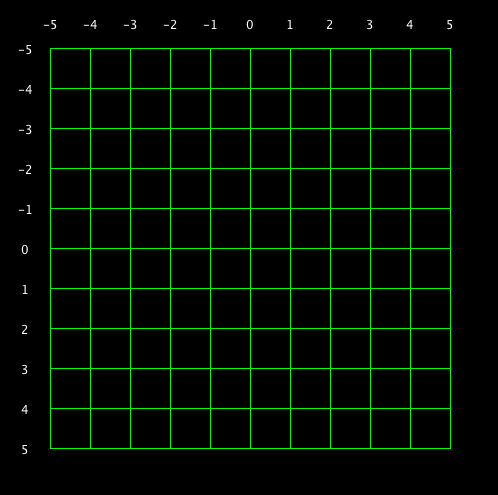

# Creative Coding 2025

[](https://www.youtube.com/watch?v=xF7VrXZqLko)


Resources
---------
* [The Coding Train](https://www.youtube.com/channel/UCvjgXvBlbQiydffZU7m1_aw)
* [The Nature of Code](http://natureofcode.com/)
* [Games Fleadh](http://www.gamesfleadh.ie/)
* Python
* [Py5](https://py5coding.org/)
* Processing
* Java
- https://github.com/maurymarkowitz/101-BASIC-Computer-Games
- [MSX Online](https://webmsx.org/)
- https://codingbat.com/python
- [Self enrole in this Brightspace](Creative Coding DMEDH1082: Sept-Dec Academic Term 2025/26)!

## Contact me
* Email: bryan.duggan@tudublin.ie
* [My website & other ways to contact me](http://bryanduggan.org)


What you will need to install:

- Python
- Java
- VSCode
- Git
- py5

## Week 5 - Lists, dictionaries, slicing

- [Python Fundamentals](python_fundamentals.pdf)

### Lab 

# Creative Coding Lab: Lists, Dictionaries, Strings & Slicing

## Part 1: Strings and Slicing Warm-Up

### Task 1: Player Names and Welcome Messages
Create a variable with a player name and practice string manipulation:
- Store a player name like "SHADOWHUNTER_99"
- Convert it to lowercase
- Extract just the username part (before the underscore)
- Create a welcome message using f-strings: "Welcome, {username}!"

### Task 2: Dialogue System
Create a long dialogue string from a game NPC:
```python
dialogue = "Greetings, traveler! I have a quest for you. Find the ancient sword in the dark forest."
```
- Use slicing to extract just the first sentence
- Get the last 20 characters
- Extract every second character (step slicing)
- Find the word "quest" using string methods

### Task 3: Cheat Code Parser
Game cheat codes often need to be processed:
- Create a cheat code string: "POWERUP_HEALTH_MAX"
- Use `split()` to break it into parts
- Use `replace()` to change underscores to spaces
- Practice slicing to get the first word, last word, and middle word

## Part 2: Lists for Game Elements

### Task 4: Inventory System
Create a basic inventory using lists:
- Make a list of 5 items: `["sword", "potion", "shield", "key", "map"]`
- Add a new item to the inventory
- Remove an item the player used
- Check if a specific item is in the inventory
- Print how many items the player has

### Task 5: Enemy Spawn List
Create a list of enemy types and manipulate it:
- Start with: `enemies = ["goblin", "orc", "troll"]`
- Add a boss enemy at the end
- Insert a new enemy type at position 1
- Create a slice of the first 2 enemies
- Reverse the list to change spawn order
- Make a copy of the list for a second level

### Task 6: High Scores
Work with a list of numbers representing scores:
- Create a list: `scores = [1500, 2300, 1800, 3200, 2100]`
- Find the highest score using `max()`
- Find the lowest score
- Sort the scores in descending order
- Get the top 3 scores using slicing
- Calculate the average score

## Part 3: Dictionaries for Game Data

### Task 7: Player Stats
Create a dictionary to store player attributes:
```python
player = {
    "name": "Hero",
    "health": 100,
    "mana": 50,
    "level": 1
}
```
- Access and print the player's health
- Update the health after taking damage
- Add a new stat like "experience"
- Print all the stat names (keys)
- Print all the values

### Task 8: Item Database
Create a dictionary of game items with their properties:
```python
items = {
    "sword": {"damage": 15, "type": "weapon"},
    "potion": {"healing": 25, "type": "consumable"},
    "shield": {"defense": 10, "type": "armor"}
}
```
- Access the damage value of the sword
- Add a new item with its properties
- Print all item names
- Check if "potion" exists in the items
- Update the shield's defense value

### Task 9: Game Settings
Create a settings dictionary:
```python
settings = {
    "difficulty": "normal",
    "sound_volume": 75,
    "music_on": True,
    "controls": ["W", "A", "S", "D"]
}
```
- Change the difficulty to "hard"
- Adjust the volume
- Access the control keys and print just the first two
- Add a new setting for screen resolution

## Part 4: Combining Concepts with py5

### Task 10: Drawing Collectible Items
Use a list to draw multiple coins on screen:
```python
def setup():
    size(600, 400)

def draw():
    background(220)
    coin_positions = [100, 200, 300, 400, 500]
    
    for x in coin_positions:
        fill(255, 215, 0)
        circle(x, 200, 30)
```
- Run this code
- Add y-coordinates by making it a list of lists: `[[100, 200], [200, 150], ...]`
- Modify to draw coins at different positions

### Task 11: Color-Coded Health Bar
Use slicing and dictionaries to create a health bar:
```python
player_stats = {
    "health": 75,
    "max_health": 100
}

def setup():
    size(400, 200)

def draw():
    background(50)
    
    # Health bar
    bar_width = 300
    current_width = (player_stats["health"] / player_stats["max_health"]) * bar_width
    
    # Background bar
    fill(100)
    rect(50, 50, bar_width, 30)
    
    # Health bar (changes color based on health)
    if player_stats["health"] > 50:
        fill(0, 255, 0)  # Green
    elif player_stats["health"] > 25:
        fill(255, 255, 0)  # Yellow
    else:
        fill(255, 0, 0)  # Red
    
    rect(50, 50, current_width, 30)
```
- Experiment with different health values
- Add a text label showing the health numbers

### Task 12: Enemy Wave System
Create a system that spawns enemies in waves using lists and dictionaries:
```python
current_wave = 0
waves = [
    {"enemies": ["goblin", "goblin"], "count": 2},
    {"enemies": ["goblin", "orc", "goblin"], "count": 3},
    {"enemies": ["orc", "orc", "troll"], "count": 3}
]

def setup():
    size(600, 400)
    text_size(16)

def draw():
    background(220)
    
    # Display current wave info
    wave_data = waves[current_wave]
    
    fill(0)
    text(f"Wave {current_wave + 1}", 20, 30)
    text(f"Enemies: {wave_data['count']}", 20, 50)
    
    # Display enemy types
    y_pos = 80
    for i, enemy in enumerate(wave_data['enemies']):
        text(f"{i+1}. {enemy}", 20, y_pos)
        y_pos += 25

run()
```
- Modify the code to add a 4th wave
- Add a "boss" property to wave dictionaries (True/False)
- Display boss waves differently


### Task 14: Inventory Grid Visualization
Create a visual inventory grid using nested lists:
```python
inventory_grid = [
    ["sword", "potion", None],
    ["shield", None, "key"],
    [None, "map", "coin"]
]

def setup():
    size(400, 400)

def draw():
    background(200)
    
    cell_size = 100
    for row in range(3):
        for col in range(3):
            x = col * cell_size + 50
            y = row * cell_size + 50
            
            # Draw cell
            fill(255)
            stroke(0)
            rect(x, y, 80, 80)
            
            # Draw item if exists
            item = inventory_grid[row][col]
            if item:
                fill(0)
                text_align(CENTER, CENTER)
                text(item, x + 40, y + 40)

run()
```
- Add more items to the grid
- Change the grid to 4x4
- Add color coding for different item types

### Task 15: Player Profile System
Combine everything into a complete player profile:
```python
player_profile = {
    "username": "DragonSlayer_42",
    "stats": {"health": 100, "mana": 80, "stamina": 60},
    "inventory": ["sword", "potion", "shield"],
    "quest_log": ["Find the ancient tome", "Defeat 10 goblins"],
    "achievements": ["First Blood", "Survivor"]
}
```
- Access and print just the username (without the number)
- Add a new item to inventory
- Mark a quest as complete by removing it
- Add a new achievement
- Calculate total stat points
- Create a formatted status report that prints all information nicely

## Bonus Challenges

### Bonus 1: Loot Drop System
Create a random loot system using lists and dictionaries. Items should have rarity levels.

### Bonus 2: Dialogue Tree
Build a branching dialogue system using nested dictionaries where each choice leads to different responses.

### Bonus 3: Leaderboard
Create a leaderboard system that stores player names and scores in a list of dictionaries, then sorts them by score.

## Week 4 - Trigonometry
- [Slides](trigonometry.pdf)

### Lab - Flower Jam

Form a group. Go out into the campus and take pictures of patterns you find in nature and the environment around you

Share on discord

Use loops and Py5 to create artistic interpretations of things that you find

Combine your sketches with those of your team mates and make a collage

Share your creations on discord. Upload the code and some screenshots to brightspace to get your mark for this week 

## Week 3 - Loops

### Lab

Draw these:





## Week 2 - Python Fundamentals

### Lab

Variables exercises:

[](https://www.youtube.com/watch?v=kPOFqXsLLeo)

If statement Exercises:

[](https://www.youtube.com/watch?v=18kMOeygmHA)

- [Learn how to use bash and git](https://github.com/skooter500/csresources/blob/main/gitlab.md)

- [Submit your git repos](https://forms.office.com/Pages/ResponsePage.aspx?id=yxdjdkjpX06M7Nq8ji_V2ou3qmFXqEdGlmiD1Myl3gNUQjhSVU9PUExTV05UNlFNV0JHSjVQMjZFUy4u)

## Week 1 - Introduction to the Course
- Check out [these Sci-Fi user interfaces made by OOP students](https://www.youtube.com/playlist?list=PL1n0B6z4e_E5RZYrubD2pcxq0qzGy-3vr)
- Check out [these music visualisers made in Processing by previous programming students](https://www.youtube.com/watch?v=NGQbYEESZEg&list=PL1n0B6z4e_E7I2bIWWpH8NAa6kPx95sw5)
- If you are curious, check out [some of my creature videos](https://www.youtube.com/watch?v=cW8s5i9dmqA&list=PL1n0B6z4e_E6jErrS0ScSCaVrN7KV729x)

- [Python Notes](week1/python_complete_presentation.pdf)
- [Python Quick Reference (Printable)](week1/python_quick_ref.html)

Write a sketch to draw the following shape:

