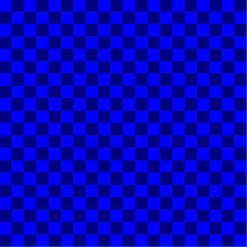

# Creative Coding 2025

Resources
---------
* [The Coding Train](https://www.youtube.com/channel/UCvjgXvBlbQiydffZU7m1_aw)
* [The Nature of Code](http://natureofcode.com/)
* [Games Fleadh](http://www.gamesfleadh.ie/)
* Python
* [Py5](https://py5coding.org/)
* Processing
* Java
- https://github.com/maurymarkowitz/101-BASIC-Computer-Games
- [MSX Online](https://webmsx.org/)
- https://codingbat.com/python

## Contact me
* Email: bryan.duggan@tudublin.ie
* [My website & other ways to contact me](http://bryanduggan.org)

What you will need to install:

- Python
- Java
- VSCode
- Git
- py5

## Week 3 - Loops

### Lab

Draw these:

## Week 2 - Python Fundamentals

### Lab

Variables exercises:

If statement Exercises:

- [Learn how to use bash and git](https://github.com/skooter500/csresources/blob/main/gitlab.md)

- [Submit your git repos](https://forms.office.com/Pages/ResponsePage.aspx?id=yxdjdkjpX06M7Nq8ji_V2ou3qmFXqEdGlmiD1Myl3gNUQjhSVU9PUExTV05UNlFNV0JHSjVQMjZFUy4u)

## Week 1 - Introduction to the Course
- Check out [these Sci-Fi user interfaces made by OOP students](https://www.youtube.com/playlist?list=PL1n0B6z4e_E5RZYrubD2pcxq0qzGy-3vr)
- Check out [these music visualisers made in Processing by previous programming students](https://www.youtube.com/watch?v=NGQbYEESZEg&list=PL1n0B6z4e_E7I2bIWWpH8NAa6kPx95sw5)
- If you are curious, check out [some of my creature videos](https://www.youtube.com/watch?v=cW8s5i9dmqA&list=PL1n0B6z4e_E6jErrS0ScSCaVrN7KV729x)

- [Python Notes](week1/python_complete_presentation.pdf)
- [Python Quick Reference (Printable)](week1/python_quick_ref.html)

Write a sketch to draw the following shape:

