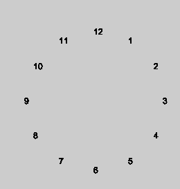

# Creative Coding 2025

Resources
---------
* [The Coding Train](https://www.youtube.com/channel/UCvjgXvBlbQiydffZU7m1_aw)
* [The Nature of Code](http://natureofcode.com/)
* [Games Fleadh](http://www.gamesfleadh.ie/)
* Python
* Py5
* Processing
* Java

## Contact me
* Email: bryan.duggan@tudublin.ie
* [My website & other ways to contact me](http://bryanduggan.org)

## Exercises

Draw the following shapes. Use variables and loops in your solutions!

I'ts best to spend some time thinking about the variables and how they are changing before writing code:

These require ONE loop:

This shape draws lines from the sides that all meet in the middle. This can be done using one loop, but is better with two:

This sketch always draws 10 equally sized circles across the screen. This should work no matter what you set the screen size to. You should also declare a variable to hold the number of circles to draw so that if you change this number, the sketch should still work:

This sketch places circles around the outside of a bigger circle to make a flower pattern. Once you figure this out, you can modify it to do something cool with colours:

This sketch prints the numbers of the clock around in a circle:

This sketch requires you to put one loop inside another and also use a boolean variable, though there are other ways to do this:

This is what it looks like when all the above code is in one sketch:

Try and draw this using ONE for loop:

Write a sketch that can draw regular polygons like squares, pentagons, octogons etc:

Write a sketch that can draw stars like these:

[Conditional operations](https://docs.google.com/document/d/1eRqL4RBA9pwyj7L8jQEhiJVpbvoIfGiP/edit?usp=sharing&ouid=113463557400115436734&rtpof=true&sd=true)
- Task 1: Changing window colour
- Task 2: Moving a rectangle across window
- Task 3: A simple rollover
- Task 4: Fading colour
- Task 5: Moving a ball across window using Boolean variables
- Task 6: A bouncing ball (step-by-step addition conditions)

Here is a youtube video of 4 sketches you can program today:

In your solution use the following processing functions:
- fill
- rect
- ellipse
- background
- stroke
- noStroke

And the mouseX and mouseY varibles. You can also use the + - * / operators

What is happening:

- The ground takes up half the window size
- The spaceship is 100 pixels wide and is *centered* around the mouse position.
- The person starts at the right side of the screen and moved from right to left

Use variables wherever practical in your sketch and calculate positions and sizes relative to these variables.

Bonus!

There are few things you can try (but you will probably have to read ahead and figure out how the if statement works)

- Come up with a more beautiful looking spaceship and person
- Change the colours of everything
- Make a car that drives from left to right
- When the person reaches the left side of the screen, he should switch direction
- Make the lights on the spaceship flash different colours

## Lecture
- [Introduction Slides](python_complete_presentation.pdf)

